  
# Random Encounters module for FVTT

Adds the ability to create Random Encounters for Scenes.

Each random encounter can be run on time intervals and dice chance, and will roll from a Rollable Table.

Will not trigger an encounter if players are already in combat.

## Installation Instructions

Copy  into the module installer inside foundry when it asks for the manifest.

OR

Simply create a folder named 'random-encounters' in public/modules and git clone this repository there. Makes it easy to pull updates in the future.

OR

Download the zip, create a folder in Data/modules called 'random-encounters' and extract the contents of "random-encounters-master.zip" there.

## How To Use

You can find the settings for Random Encounters under General Module Settings (Note: I have no idea why its not under its own name, I am still working on that)

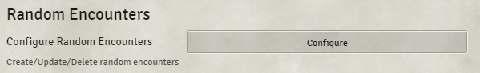

Click on Configure to add new Random Encounters.

You can change the Hot Key to trigger any Random Encounters.

### Adding new Encounter

Click on the Add Encounter button.

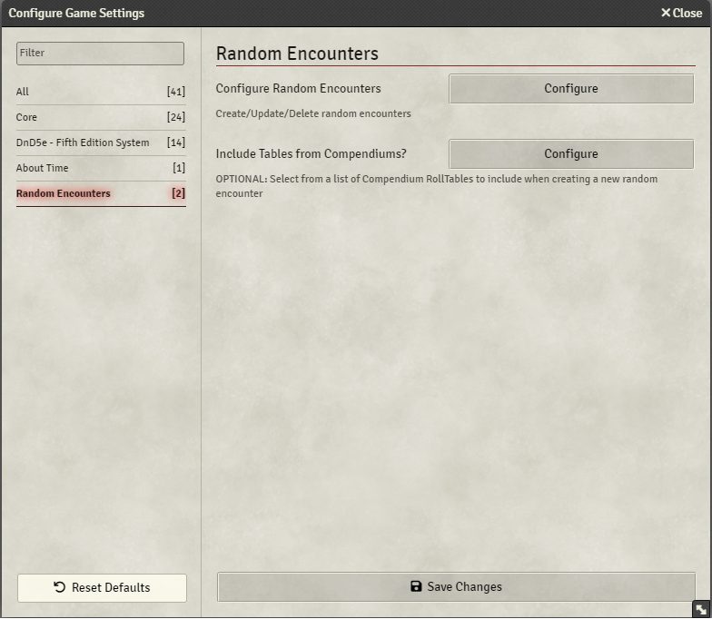

It will create a new Random Encounter Template.

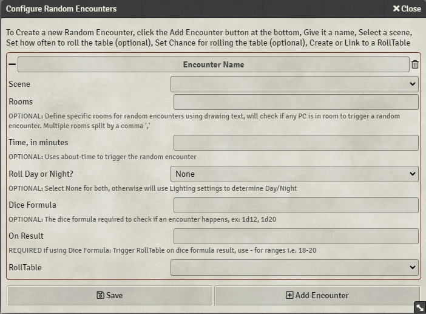

* **Encounter Name** - A name for your encounter, will be used when displaying a chat message.
* **Scene** - A scene to tie the random encounter to, when rolling for random encounters it will only roll the encounters for the active scene that has Player Characters on it.
* **Rooms** - An Optional Setting. If your scene has specific areas that have random encounter you can use the drawing tools to create rooms/areas in a scene. If a Player Character is located within the room in the scene, it will trigger the random encounter.
* **Time**, in minutes - An Optional Setting. If you have about-time module installed, you can define a duration in minutes to automatically trigger a random encounter.
* **Roll Day or Night?** - An Optional Setting. Using the Lighting Controls to Transition to Daylight/Darkness, you can set optional settings if your random encounter needs to be triggered at day/night. If neither is required use None (the default) to trigger on both settings.
* **Dice Formula** - An Optional Setting. If your random encounter has a chance to trigger, for example on a roll of a 1d20 result of 20 do a random encounter. If using this setting you must set a value in the On Result setting.
* **On Result** - Required if using Dice Formula. Either a set number (1 or 20) or a range of numbers (1-3 or 18-20). Ranges are a lower number hyphen and higher number. If on the roll of 1d20 the number falls within the range or is an exact match will trigger the random encounter.
* **RollTable** - Select a RollTable to roll. These RollTables will have the random encounter table defined as needed.
* **New RollTable** - Will open a RollTable Creation Dialog box, just like if you where to do so on the RollTable tab. Note: If you create a RollTable with the Settings window open it will not be displayed at first, you will need to close then reopen the settings.

Example of a RollTable for Random Encounters

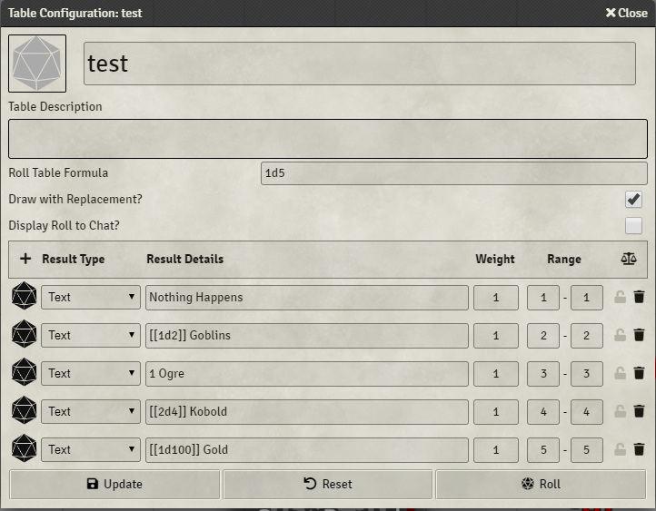

See https://foundryvtt.com/article/roll-tables/ for more examples on how RollTables work.

Settings to note:
* Make sure to uncheck Display Roll to Chat? This will be taken care of by the random encounter code.
* Make sure to check Draw with Replacement? This will make sure to roll all options and not disable once one has been rolled.

## Examples

### Random Encounter for a Scene

If you have a random encounter that triggers anywhere on a scene, you can set one up using settings similar to the following:

#### RollTable
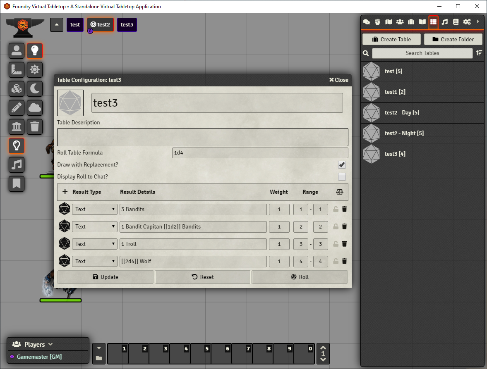

Roll a 1d4 to find a Random Encounter from the list.

#### Random Encounter Settings
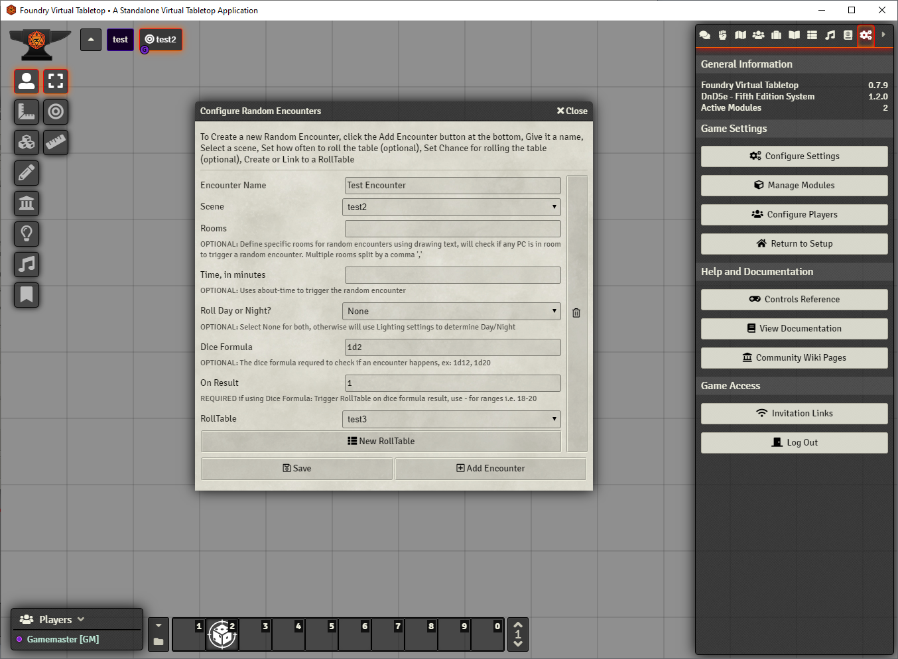

Set the Encounter Name. Select the Scene for the random encounter. Set a Dice Formula and On Result. Set RollTable.

#### Trigger Random Encounter
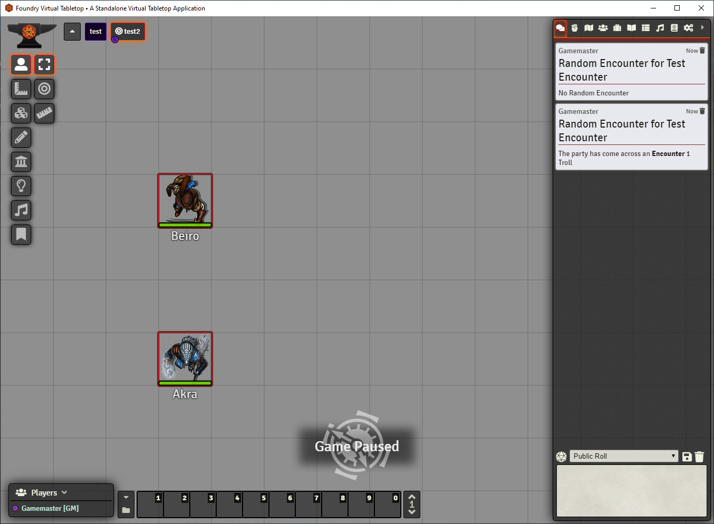

Either hit the Trigger Random Encounter Hot Key or if you specified a time wait for the random encounter to be triggered.

First chat box is the result of the Dice Formula not rolling the On Result condition.

Second chat box is the result of the Dice Formula rolling the On Result condition.

### Random Encounter for a Room/Area within a Scene

If you have a random encounter that only needs to happen within a specific area or room within a scene you can using the drawing tools to create a room/area. Make sure to name the drawing, Random Encounters will check for use the name to find the room/area to check if Player Characters are within the room.

NOTE: if no player characters are within a room and you trigger a random encounter, either by hitting the hot key or the specified time is reached, not chat box will be displayed.

#### RollTable
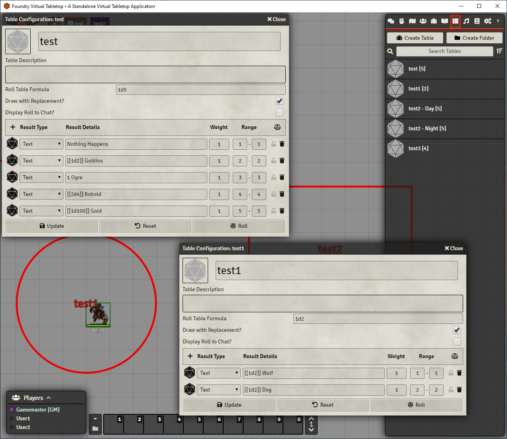

Defined two room Random Encounter RollTables.

#### Room/Area Drawings

Use the drawing tools to create a drawing, Random Encounter can use either the Rectangle, Ellipse, or Polygon drawings to determine the area/room trigger.

NOTE: make sure to name the drawing using the Text Label settings. This will be used to tie back to the Random Encounter.

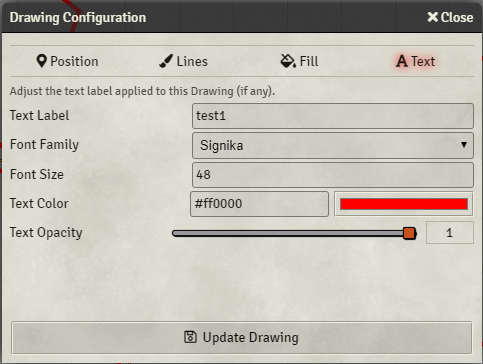

#### Random Encounter Settings
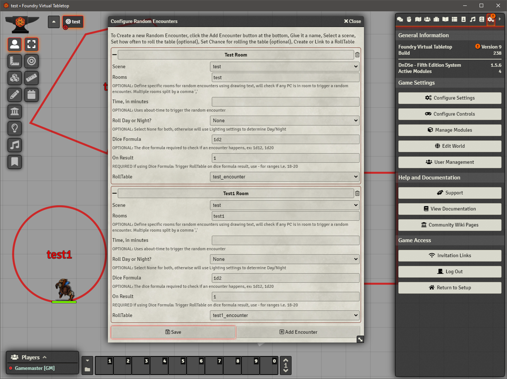

Setup two random encounters for each room within the scene. Settings to Note:
* Rooms - make sure you have named the drawing and the name in the setting the be exactly the same.

#### Trigger Random Encounter
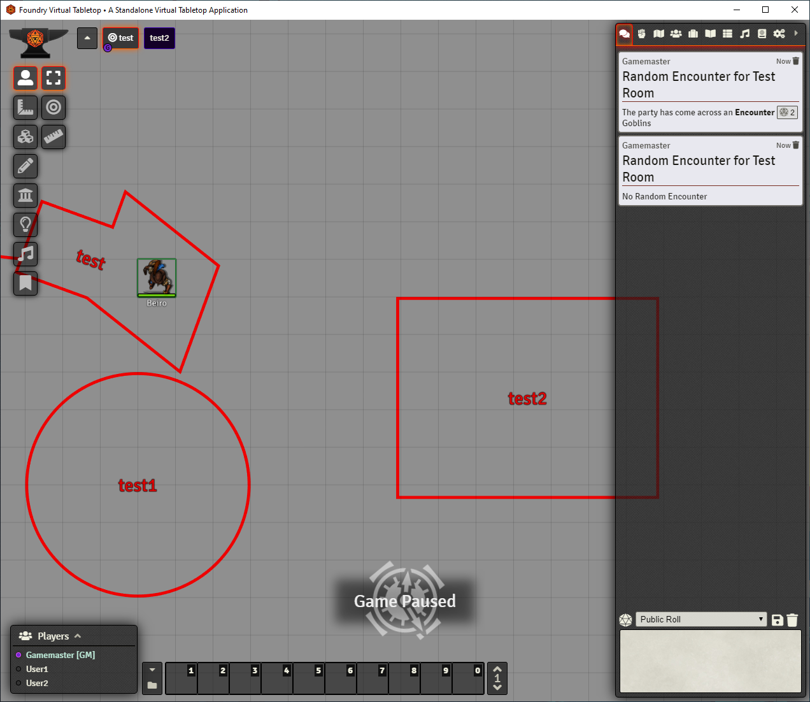

Rolling for a random encounter in the test room.

First chat box is a success of a random encounter trigger.

Second chat box is a failure of a random encounter trigger.

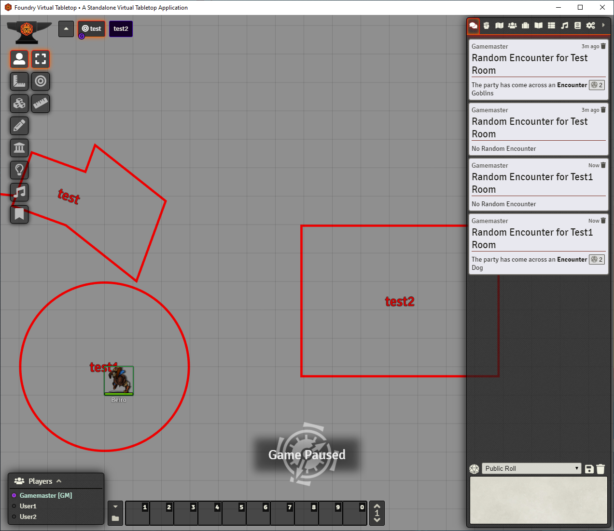

Rolling for a random encounter in the test1 room.

First chat box is a success of a random encounter trigger.

Second chat box is a failure of a random encounter trigger.

### Random Encounter for a Day/Night

If your random encounter has a specification of only triggering if the player characters are at night or during the day, you can set the settings to make sure the RollTable is only triggered based on the lighting settings.

#### RollTable
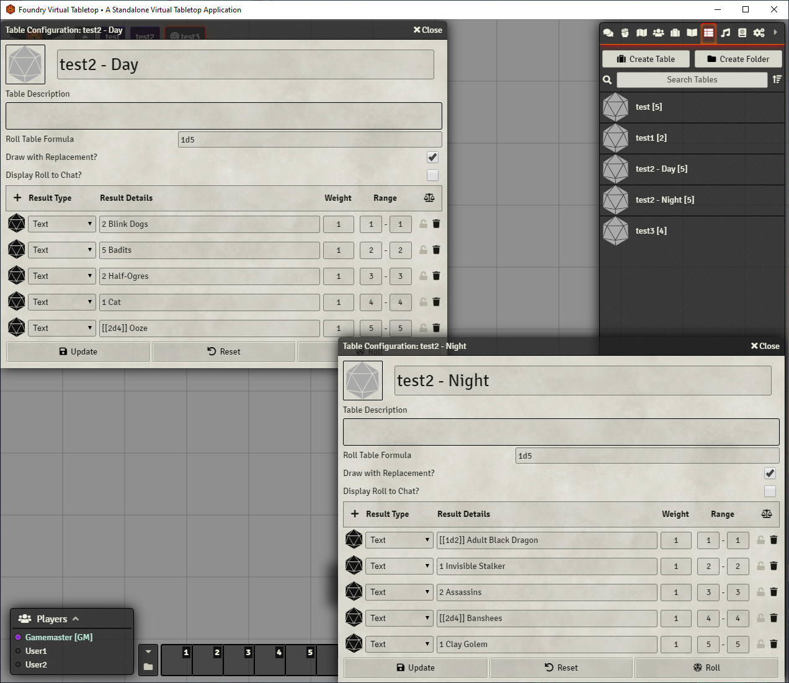

Setup two different RollTables, one to roll for Day Encounters and one to roll for Night Encounters.

#### Random Encounter Settings
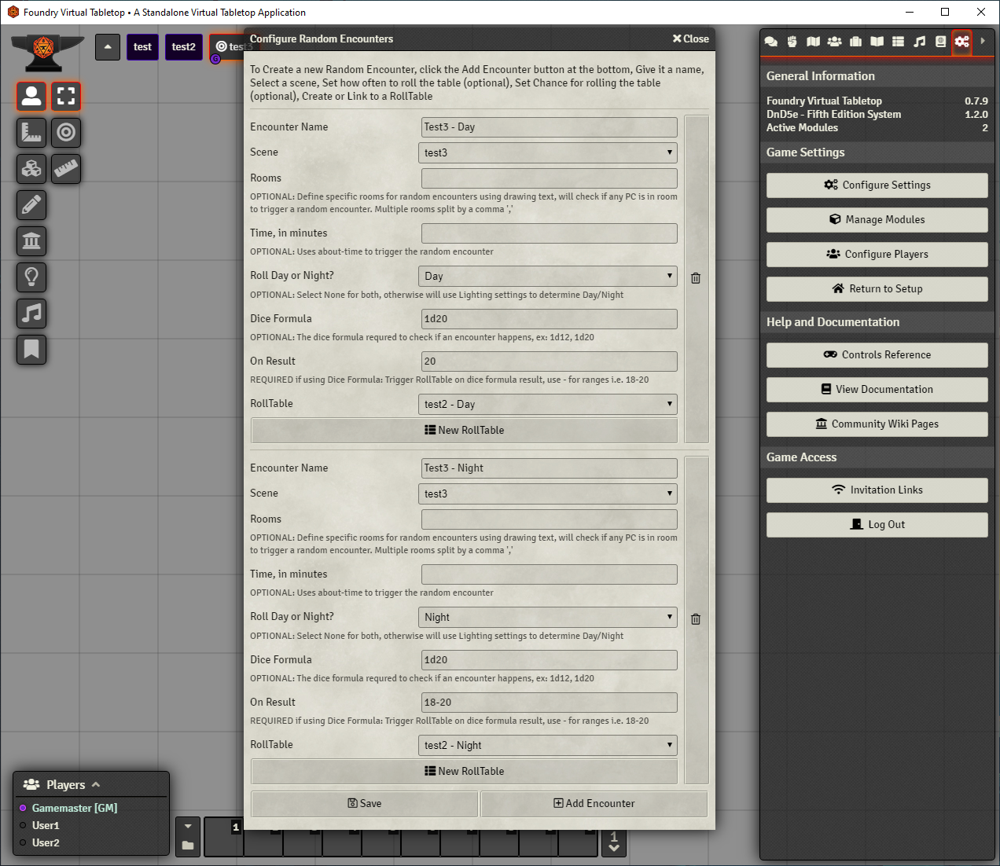

Setup two different Random Encounter settings, one to roll for Day Encounters and one roll for Night Encounters. Settings to Note:
* Roll Day or Night? - Set to either Day or Night, if setting to None it will trigger for both Day and Night.

#### Trigger Day Random Encounter
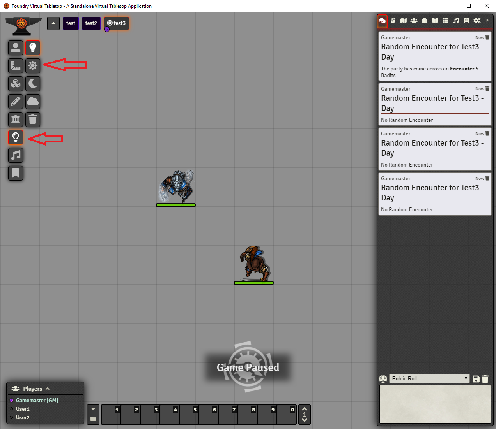

With the Lighting Settings and having the Transition to Daylight enabled, will trigger the day roll table.

#### Trigger Night Random Encounter
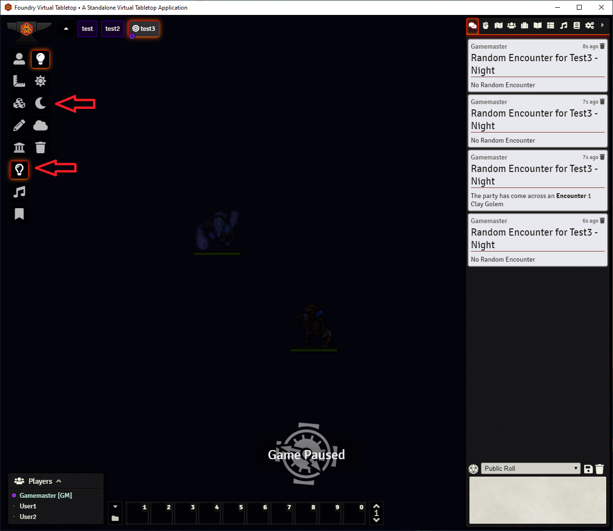

With the Lighting Settings and having the Transition to Darkness enabled, will trigger the night roll table.
