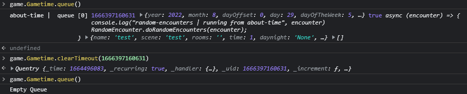

Figured out a bug that wasn't causing the mod to remove the old about-time event when updating/saving a random encounter. This means there is a possibility of events in the about-time queue that are just hanging around and don't need to be.

There are a few steps to remove these old random encounters to clear up the queue.

* Run the following command int the console (F12) to determine if you have anything in the about-time queue
  * `game.Gametime.queue()`
* Two Options can occur
  1. Everything in the Queue is Random Encounters
    * You can run the following `game.Gametime.flushQueue()` to clear **ALL** events in the queue
  2. There are Random Encounters and Other Events
    * Locate all the about-time event IDs associated with Random Encounter event as seen in the image below
	* Run the following command with every ID `game.Gametime.clearTimeout( ID_NUMBER_HERE )` replace `ID_NUMBER_HERE` with the ID
* Once all the old random encounter events have been removed you can then re-save your Random Encounters

